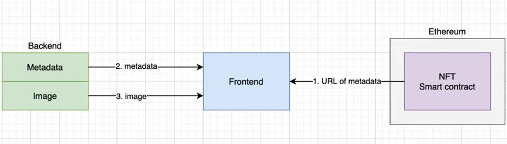

# My_Learning_NFT
Learn everything about NFT

## About
* Learn about token standard like ERC721, ERC1155.
* Learn about marketplaces like Opensea, Rarible, etc. Where they charge fees.
	- They mostly charge fees where there is a transaction sent on blockchain for any activity.
* NFTs (Non-Fungible Tokens) can be summed up with one word: "unique". These are smart contracts deployed on a blockchain that represent something unique.
* Unlike FT, Non-fungible tokens have token ids. Fungible tokens (FT) are all identical.
* Unlike ERC20 standard which has 1 token type/id, the ERC721 has many token types/ids.
* When someone transfers NFT to someone, unlike FT where they just have to know the contract address, here they shall have to know both
	- nft contract address
	- nft token id

### Metadata
* All NFTs have what’s called metadata. Each `tokenId` has a specific `tokenURI` that defines this API call, which returns a JSON object that looks something like this:
```json
{
    "name": "You NFT token name",
    "description": "Something Cool here",
    "image": "https://ipfs.io/ipfs/QmTgqnhFBMkfT9s8PHKcdXBn1f5bG3Q5hmBaR4U6hoTvb1?filename=Chainlink_Elf.png",
    "attributes": [...]
}
```
* You’ll notice the metadata has four distinct keys.
	- _name_ which defines the tokenIds human-readable name
	- _description_ which gives some background information on the token
	- _image_ which is another URI to an image
	- _attributes_ which allow you to display the stats of your token

> It’s important that if your NFT interacts with other NFTs to make sure that the attributes on the `tokenURI` match the attributes of your NFT smart contract, otherwise you may get confused when battles or interactions don’t pan out as expected!

### Storage
* The NFT assets (in image, gif, video formats) is stored in IPFS cloud:
	- Centralized: [Pinata](https://www.pinata.cloud/), [Moralis](https://docs.moralis.io/moralis-server/files/ipfs).
	- Decentralized: [Arweave](https://github.com/ArweaveTeam/arweave-deploy#deploy-a-file).
* Problem of storing data on-chain:

> Basically, what the community found out was that storing images is really taxing and expensive to do on Ethereum. If you want to store a 8 x 8 picture, storing this much data is pretty cheap, but if you want a picture with decent resolution, you’ll need to spend a lot more.

> The cost of data storage is (about) 640k gas per Kb of data. If the current gas price is approximately 50 Gwei or 0.000000050 ETH, and 1 ETH equals $600 presently, you’ll be spending $20. $20 to add that to the blockchain. This didn’t really excite NFT creators.

* Storing metadata on-chain & off-chain: The _name_, _description_, and _attributes_ are easy to store on-chain, but the _image_ is the hard part. It would be better if we could store our images on-chain so that they can’t go down or get hacked. That's why __IPFS__. This is to ensure the NFT asset with image is not duplicated elsewhere. And this is ensured by creating a hash based on the image & directed to a link of IPFS like `https://ipfs.io/ipfs/QmTgqnhFBMkfT9s8PHKcdXBn1f5bG3Q5hmBaR4U6hoTvb1?filename=Chainlink_Elf.png`. This is ideal for storing images since it means that every time the image is updated, the on-chain hash/tokenURI also has to change, meaning that we can have a record of the history of the metadata. It’s also really easy to add an image onto IPFS and doesn’t require running a server!

## Marketplace
This is an example where the technicality will be explained:

* Whenever a user creates an NFT, it gets created with one standard like ERC721.
* Thereafter the minting right of the token is reserved with the creator. Now, minting process can be of 2 types:
	1. Minting __NOT__ allowed after the NFT creation. Meaning the no. which is minted during the creation of a token type/id is final.
	2. Minting is allowed after the NFT creation. Meaning additional no. can be generated based on the requirement of market. E.g. items on Amazon marketplace gets created when there is a demand from the customer.

### Opensea
* No fees for
	- creating account (just login using Metamask wallet)
	- setting up profile with username, account name, email address.
	- creating collection (contains NFT assets)
	- creating item with upload NFT asset (img, gif, vid), set mint qty, set price mode (fixed, bidding, bundle), select payment currency.
* Fees for
	- Sell items i.e. pressing a sell button & signature using private key via Metamask type wallets.

## Coding



* Any NFT platform has 3 parts:
	1. Front-end
	1. Smart contract
		- stores the token id
		- stores the metadata URL
	1. Backend
		- stores the metadata like name, description, image (which stores the IPFS url), attributes.
		- stores the asset in IPFS cloud
* In programming, an NFT is not an image or a gif, it’s a number that has the owner a wallet.
* And the no. is managed.
* E.g. In this url - `https://opensea.io/assets/0x80a4b80c653112b789517eb28ac111519b608b19/6236`, NFT is the number `6236`.
* The Smart contracts handling the ownership of the NFTs are ERC721 and ERC1155.
* In the smart contract there’s a function called tokenURI (or uri for ERC1155) , that base URI must be public and starts with `https://` or `ipfs://`
* for example for the above NFT `6236` the smart contract is is located here `https://etherscan.io/address/0x80a4b80c653112b789517eb28ac111519b608b19` has the token URI `https://api.cryptocannabisclub.com/metadata/6236`
* The base URI: `https://api.cryptocannabisclub.com/metadata/`
* In order to get the token URI just append the token id with the base URI. E.g:
	- For `1` token id, the base URI: `https://api.cryptocannabisclub.com/metadata/1`

### Standards
#### ERC721
* cons:
	- Every token `id` has a balance of `1` (by default) & owner (could be creator or holder).
* coded as:
```
// mapping(id => owner)
mapping(uint256 => address) _owners;
// mapping(owner => balances)
mapping(address => uint256) private _balances;
```

#### ERC1155: inspired from ERC20, ERC777, ERC721.
* For NFT, it's `ERC721 + batch transfer of tokens (with different ids)`.
* very helpful for games, where a user buying weapons of different type (or id) which is gettting transferred at a time (i.e. batch transfer).
* allows you to create Fungible, Non-Fungible, and Semi-Fungible in one single token standard. Both Fungible and Non-Fungible tokens can be created using the same standard.
* The distinctive feature of ERC1155 is that it uses a single smart contract to represent multiple tokens at once. This is why its balanceOf function differs from ERC20’s and ERC777’s: it has an additional id argument for the identifier of the token that you want to query the balance of.
* This is similar to how ERC721 does things, but in that standard a token id has no concept of balance: each token is non-fungible and exists or doesn’t. The ERC721 balanceOf function refers to how many different tokens an account has, not how many of each. On the other hand, in ERC1155 accounts have a distinct balance for each token id, and non-fungible tokens are implemented by simply minting a single one of them.
* Every token `id` has a balance & owner (could be creator or holder).
* coded as:
```
// mapping(id => owner)
mapping(uint256 => address) _owners;
// mapping(owner => balances)
mapping(address => uint256) private _balances;
```
* This approach leads to massive gas savings for projects that require multiple tokens. Instead of deploying a new contract for each token type, a single ERC1155 token contract can hold the entire system state, reducing deployment costs and complexity.
* Because all state is held in a single contract, it is possible to operate over multiple tokens in a single transaction very efficiently. The standard provides two functions, balanceOfBatch and safeBatchTransferFrom, that make querying multiple balances and transferring multiple tokens simpler and less gas-intensive.
* In the spirit of the standard, we’ve also included batch operations in the non-standard functions, such as _mintBatch.
* E.g. 
	- There is one Mona Lisa artwork, which is worth millions of dollars and can be represented by __Non-Fungible ERC-1155__. Now there can also be several other copies of the artwork, which can be sold as __Fungible ERC1155__. The ERC1155 gives accessibility, simplicity, and efficiency on the buyer side.
	- In games, you earn _points_ and buy _items_ using these points in a game. At the same time, you can exchange items too. The “items” can be represented by __Non-Fungible ERC-1155__ and “points” can be represented as __Fungible ERC-1155__.


### Token/Asset ID
* Generating token/asset id(s) can be done in 2 ways:
	- __on-chain__:
		+ sequential or non-dynamic: 
			- pseudo random id: Using blocknumber, timestamp, global counter. The digit has to be long so as to support more different NFT assets.
			- pure random: Using Chainlink VRF Oracle based service.
	- __off-chain__: generated outside smart contract & then parsed into the NFT creation function of contract.


## References
### Articles
* [How to Make an NFT and Render it on the OpenSea Marketplace](https://www.freecodecamp.org/news/how-to-make-an-nft-and-render-on-opensea-marketplace/)
* [Build, Deploy, and Sell Your Own Dynamic NFT | Chainlink](https://blog.chain.link/build-deploy-and-sell-your-own-dynamic-nft/)
* [ERC-1155 proposal](https://github.com/ethereum/EIPs/blob/master/EIPS/eip-1155.md)
* [Token Standards: ERC20 vs ERC721 vs ERC1155](https://medium.com/coinmonks/token-standards-erc20-vserc721-vs-erc1155-3106f1e3f2f3)

### Videos
* [Create a Complete NFT App - Smart contract, Backend, Frontend](https://www.youtube.com/watch?v=WsZyb2T83lo)
* [Developing on OpenSea | Full Guide For Developers](https://www.youtube.com/watch?v=p88ZiBKejTY)
* [ERC721 NFT Token Standard Explained](https://www.youtube.com/watch?v=QFYU81zM_jA)
* [ERC1155 NFT Token Standard - Explained](https://www.youtube.com/watch?v=XNWd8Nl3rhA)
* [Ultimate NFT Programming Tutorial - FULL COURSE](https://youtu.be/tBMk1iZa85Y)
* [Building a Full Stack NFT Marketplace on Ethereum with Polygon](https://dev.to/dabit3/building-scalable-full-stack-apps-on-ethereum-with-polygon-2cfb)