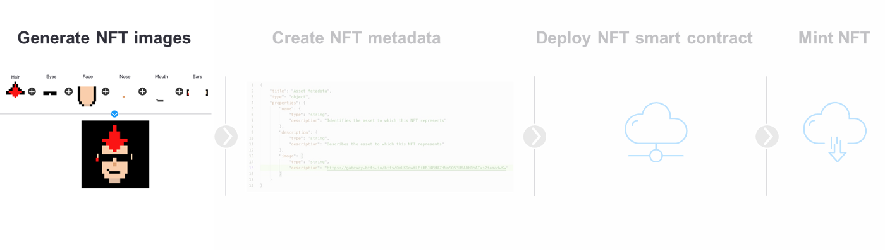

# Generative NFT art

Create generative art as NFT on Blockchain

## Background

### The origin of generative art

Generative art is an expression currently used a lot in the context of NFTs. NFTs have recently become a new way of owning a piece of generative art, and even a means to create pieces of generative art via smart contracts. The term generative art describes pieces of art that have gone through a generation process by a system that “is set into motion with some degree of autonomy contributing to or resulting in a completed work of art". **Thereby, generative art can be seen as “collaboration between an artist and an autonomous system**.”

Under this definition, NFTs are not the origin of generative art. Instead, an early example of generative art, more specifically of generative music, is Mozart’s “Musikalisches Würfelspiel” published in the late eighteenth century.

While this is an example of an early piece of generative art, created in “traditional” manners, the blockchain technology enables a new opportunity of creation. **Generative art can now be created by running a smart contract**. A smart contract is code stored on a blockchain under a certain address — mostly on Ethereum. By sending crypto — mostly ETH — to this address, the smart contract is triggered, and the code stored under the address is executed automatically.

### Generative art as NFTs

Today, the common process of creating generative art is by running a machine algorithm, no matter if it is created as an NFT or not. Minting a generative art NFT adds a level of uniqueness that could not have been reached before. This is achieved by including inputs to the piece of art such as wallet address, transaction ID or gas price.⁴ These parameters are then used to mint the NFT.

The resulting NFT piece of generative art differs from those art pieces created traditionally.

There will always exist only one NFT with these exact parameters. Even if another art piece would be created that looks very similar, the parameters included in the NFT piece of generative art would always be different, and so each piece is truly unique.

Read [more](https://medium.com/@datash/an-introduction-to-generative-art-nfts-35e650a0f281)

## Task

1. Create your own NFT collection
> - Here, the arts would be generated based on multiple layers/features/traits - face, eyes, ears, nose, mouth
> - The method followed is completely algorithmic using random trait generation.
<!-- TODO: There is another method which is based on AI -->
2. Create NFT metadata
> Here, images & its metadata would be uploaded into Pinata cloud (IPFS based).
<!-- TODO: deploy on Filecoin or Arweave as they are permanent IPFS based storage  -->

3. Deploy NFT SC
4. Mint NFT

## Coding

1. Sign up for Pinata [here](https://www.pinata.cloud/)
2. Generate an API Key [here](https://app.pinata.cloud/keys)
   - Make sure the Admin button is selected to have access to all Pinata endpoints.
   - Copy the **PinataAPIKey** and the **SecretAPIKey** to your clipboard. We will be using this later.
3. Installed the required packages using `$ pip3 install -r requirements.txt`
4. Run `$ python3 trait_generate.py` & find the output images in the "../img/output" folder.
