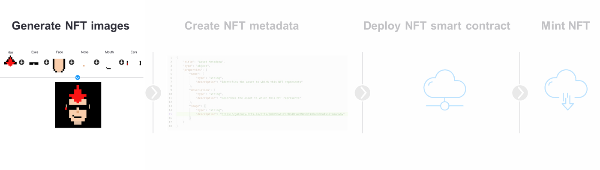

# Generative NFT art

Create generative art as NFT on Blockchain



## Background

### The origin of generative art

Generative art is an expression currently used a lot in the context of NFTs. NFTs have recently become a new way of owning a piece of generative art, and even a means to create pieces of generative art via smart contracts. The term generative art describes pieces of art that have gone through a generation process by a system that “is set into motion with some degree of autonomy contributing to or resulting in a completed work of art". **Thereby, generative art can be seen as “collaboration between an artist and an autonomous system**.”

Under this definition, NFTs are not the origin of generative art. Instead, an early example of generative art, more specifically of generative music, is Mozart’s “Musikalisches Würfelspiel” published in the late eighteenth century.

While this is an example of an early piece of generative art, created in “traditional” manners, the blockchain technology enables a new opportunity of creation. **Generative art can now be created by running a smart contract**. A smart contract is code stored on a blockchain under a certain address — mostly on Ethereum. By sending crypto — mostly ETH — to this address, the smart contract is triggered, and the code stored under the address is executed automatically.

### Generative art as NFTs

Today, the common process of creating generative art is by running a machine algorithm, no matter if it is created as an NFT or not. Minting a generative art NFT adds a level of uniqueness that could not have been reached before. This is achieved by including inputs to the piece of art such as wallet address, transaction ID or gas price.⁴ These parameters are then used to mint the NFT.

The resulting NFT piece of generative art differs from those art pieces created traditionally.

There will always exist only one NFT with these exact parameters. Even if another art piece would be created that looks very similar, the parameters included in the NFT piece of generative art would always be different, and so each piece is truly unique.

Read [more](https://medium.com/@datash/an-introduction-to-generative-art-nfts-35e650a0f281)

## Task

1. Create your own NFT collection
> - Here, the arts would be generated based on multiple layers/features/traits - face, eyes, ears, nose, mouth
> - The method followed is completely algorithmic using random trait generation.
<!-- TODO: There is another method which is based on AI -->
2. Create NFT metadata
> Here, images & its metadata would be uploaded into Pinata cloud (IPFS based).
<!-- TODO: deploy on Filecoin or Arweave as they are permanent IPFS based storage  -->

3. Deploy NFT SC
4. Mint NFT

## Coding

Here, we have the different layers/traits/features (in folder - "./img/face_parts") needed for generating unique art.

### Part A: Generate images & metadata (Using Python)

> This part can be attempted in other languages as well.

1. Installed the required packages using `$ pip3 install -r requirements.txt`
2. Go to directory - "./scripts/" & then run `$ python3 trait_generate.py` & find the output image files in the "../img/output/" folder & metadata files in the "../metadata/" folder

### Part B: Upload images & metadata (Using JS)

> - This part can be done using python as there is an unofficial python lib for Pinata: <https://pypi.org/project/pinatapy-vourhey/> which is not updated since 2020.
> - So, this part has been done using NodeJS lib for Pinata: <https://www.npmjs.com/package/@pinata/sdk> which is maintained officially on a regular basis.

1. Sign up for Pinata [here](https://www.pinata.cloud/)
2. Generate an API Key [here](https://app.pinata.cloud/keys)
   - Make sure the Admin button is selected to have access to all Pinata endpoints.
   - Copy the **PinataAPIKey** and the **SecretAPIKey** to your clipboard. We will be using this later.

3. Go to `pin-to-ipfs/generative_nft_art/` folder
4. `$ npm init -y`: create `package.json` file inside the folder.
5. `$ npm i --save-dev @pinata/sdk dotenv`: install pinata dependency package for this task.
6. Paste the **PinataAPIKey** and the **SecretAPIKey** into `.env` file created at the root of the project i.e. where `package.json` file is present.
7. `$ mkdir scripts`: Create a `scripts/` folder & add `pinImgToIPFS.js` script file for uploading the images in `img/output/` folder.
8. Run `$ node scripts/pinImgToIPFS.js` at the root of `pin-to-ipfs` project directory & get this output & all the image hashes is stored in `img_hashes.json` file.

```console
❯ node scripts/pinImgToIPFS.js
Pinning img 1 to Pinata...
        IPFS CID: QmUX9iy6yZbuMokeRXwawuGQCphhHjZqYGyHK4HwHcmPzg
Pinning img 2 to Pinata...
        IPFS CID: QmWd2ijHubsHmAvvdttMTX3kmEVWNQ6eb2ntUkM3AURKLF
Pinning img 3 to Pinata...
        IPFS CID: QmP9cbS1cvsEobodvHnfCtfjZN6fS28toTzrqRwd5sLfnU
Pinning img 4 to Pinata...
        IPFS CID: QmWtjYwUhjPFv81dhAs2MB3DHgUqFoVvWoLZ5QqJcbCy4R
Pinning img 5 to Pinata...
        IPFS CID: QmPzqSEEJrMHYcA8C8YogExwuKeXZSJQcy13m6tFE7qhPa
Data written to file
```

9. View all the image hashes here:

```console
$ code img_hashes.json
[
  "QmUX9iy6yZbuMokeRXwawuGQCphhHjZqYGyHK4HwHcmPzg",
  "QmWd2ijHubsHmAvvdttMTX3kmEVWNQ6eb2ntUkM3AURKLF",
  "QmP9cbS1cvsEobodvHnfCtfjZN6fS28toTzrqRwd5sLfnU",
  "QmWtjYwUhjPFv81dhAs2MB3DHgUqFoVvWoLZ5QqJcbCy4R",
  "QmPzqSEEJrMHYcA8C8YogExwuKeXZSJQcy13m6tFE7qhPa",
  "QmSAGCEUt9ahF2YTVVf7gz5EFx7seUPssXNw4GfxMriKEW",
  "QmRRcPr2VLJ2Gw1arS3JnHg2CQtDB2Uwk1LR2gHrRpPM3y",
  "Qmc3PmZ1Pr5yyzaChs6xPPxYzptLVzFdGoCM4Bczn6JiT3",
  "QmSieKV7jGLVT2fAeS8DDyQ9eDFx4di24BFtLFFgNR33wK",
  "QmUJJBbyE7VLkRWw8hSzg7B49NWAwKsJbvRfz7FUQzEaga"
]
```

10. Add `pinMetaToIPFS.js` script file to `scripts/` folder for uploading the metadata present in "metadata/".
11. Run `$ node scripts/pinMetaToIPFS.js` at the root of `pin-to-ipfs` project directory & get this output & all the metadata hashes is stored in `metadata_hashes.json` file.

```console
❯ node scripts/pinImgToIPFS.js
Pinning metadata 1 to Pinata...
        IPFS CID: QmUX9iy6yZbuMokeRXwawuGQCphhHjZqYGyHK4HwHcmPzg
Pinning metadata 2 to Pinata...
        IPFS CID: QmWd2ijHubsHmAvvdttMTX3kmEVWNQ6eb2ntUkM3AURKLF
Pinning metadata 3 to Pinata...
        IPFS CID: QmP9cbS1cvsEobodvHnfCtfjZN6fS28toTzrqRwd5sLfnU
Pinning metadata 4 to Pinata...
        IPFS CID: QmWtjYwUhjPFv81dhAs2MB3DHgUqFoVvWoLZ5QqJcbCy4R
Pinning metadata 5 to Pinata...
        IPFS CID: QmPzqSEEJrMHYcA8C8YogExwuKeXZSJQcy13m6tFE7qhPa
Data written to file
```

12. View all the metadata hashes here:

```console
$ code metadata_hashes.json
[
  "QmUX9iy6yZbuMokeRXwawuGQCphhHjZqYGyHK4HwHcmPzg",
  "QmWd2ijHubsHmAvvdttMTX3kmEVWNQ6eb2ntUkM3AURKLF",
  "QmP9cbS1cvsEobodvHnfCtfjZN6fS28toTzrqRwd5sLfnU",
  "QmWtjYwUhjPFv81dhAs2MB3DHgUqFoVvWoLZ5QqJcbCy4R",
  "QmPzqSEEJrMHYcA8C8YogExwuKeXZSJQcy13m6tFE7qhPa",
  "QmSAGCEUt9ahF2YTVVf7gz5EFx7seUPssXNw4GfxMriKEW",
  "QmRRcPr2VLJ2Gw1arS3JnHg2CQtDB2Uwk1LR2gHrRpPM3y",
  "Qmc3PmZ1Pr5yyzaChs6xPPxYzptLVzFdGoCM4Bczn6JiT3",
  "QmSieKV7jGLVT2fAeS8DDyQ9eDFx4di24BFtLFFgNR33wK",
  "QmUJJBbyE7VLkRWw8hSzg7B49NWAwKsJbvRfz7FUQzEaga"
]

```

13. Now, all the images & its metadata are uploaded into Pinata cloud. DONE ✅
